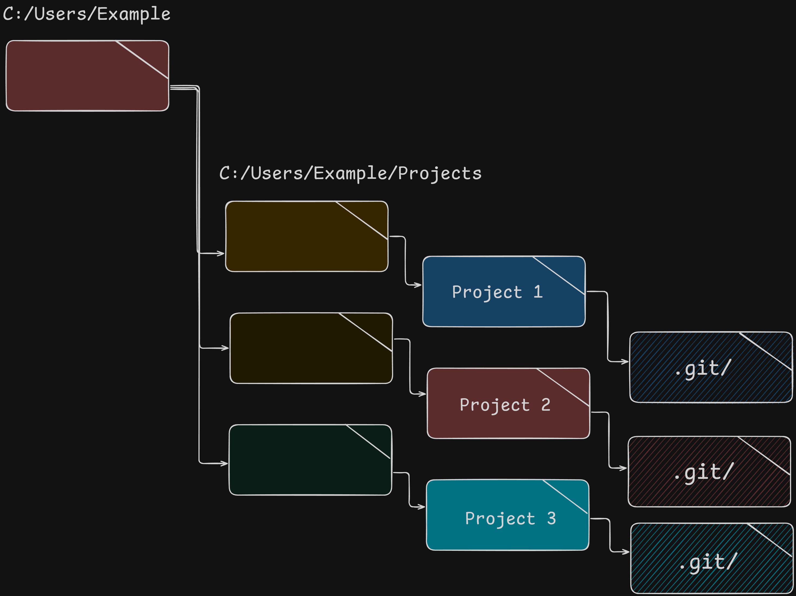
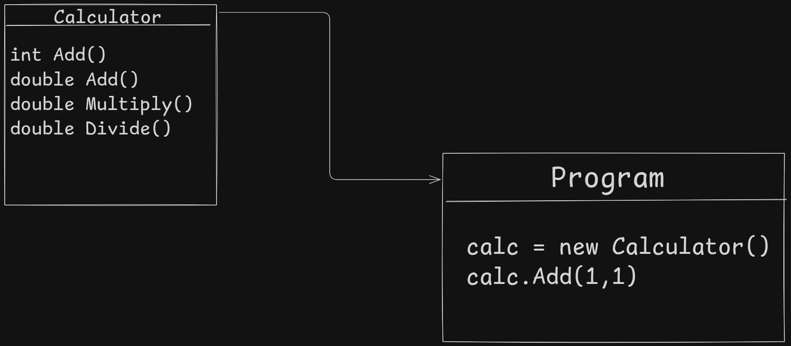

# C# Basic Lessons Week 1


### Gitignore template file for .NET Projects
```sh
dotnet new gitignore
```


### Graphics




### Data type examples & use cases

```cs
float leastPrecise = 25.5D; // least precise, but uses the least memory
double somewhatPrecise = 25.5; // more precise low memory consumption
decimal veryPrecise = 25.5m; // very precise, consumes a little more memory
```

### void/method example
```cs
        void SayHelloTenTimes()
        {
            int counter = 0;
            while (counter < 10)
            {
                counter = counter + 1;
                Console.WriteLine("counter = " + counter);
                Console.WriteLine("Hello");
                if (counter == 10)
                {
                    break;
                }
            }
        }
        SayHelloTenTimes();
```

### Code from first lessons
```cs
 // Variables
        // assinging a value to a variable
        int numberVariable = 11; // integer type (whole numbers)

        double doubleNumber = 2; // double type (decimal numbers)

        float floatNumber = 3f; // floating point type (decimal, less precise)

        decimal decimalNumber = 5m; // decimal type (very precise)

        Console.WriteLine(numberVariable + doubleNumber);

        Console.WriteLine(floatNumber / 2.8);

        Console.WriteLine(decimalNumber / 2.2m);

        double divideExpression = 11;

        Console.WriteLine(divideExpression / 2);

        string text = "my text";

        Console.WriteLine(text);

        // Data structures
        // array
        string[] shoppingList = ["eggs", "milk", "coca-cola", "beef", "red wine"];
        Console.WriteLine("Current max capacity of our array: " + shoppingList.Length);

        Console.WriteLine("Items in shopping bag:");

        foreach (string items in shoppingList)
        {
            Console.WriteLine(items);
        }

        List<string> betterShoppingList = shoppingList.ToList();

        betterShoppingList.Add("chicken");
        betterShoppingList.Add("white wine");
        betterShoppingList.AddRange(["snus", "candy", "popcorn"]);
        betterShoppingList.Remove("snus");
        Console.WriteLine("Items in cart:");
        foreach (string items in betterShoppingList)
        {
            Console.WriteLine(items);
        }
```

### Person class 
```cs
public class Person
{
    public string? Name;
    public int Age;
    public List<string> Hobbies = new List<string>();
    public string? Birthday;
}

class Program
{
    static void Main(string[] args)
    {
        // john is in this case a object instance of our Person class.
        var john = new Person
        {
            Name = "John",
            Birthday = "1/1/1992",
            Age = 34,
            Hobbies = ["Programming", "Gaming"]
        };

        Console.WriteLine($"Name: {john.Name} Age: {john.Age}, Birthday: {john.Birthday} Hobbies: {string.Join(", ", john.Hobbies)}");
    }
}
```

### Code from day 1
```cs
        // john is in this case a object instance of our Person class.
        var john = new Person
        {
            Name = "John",
            Birthday = "1/1/1992",
            Age = 34,
            Hobbies = ["Programming", "Gaming"]
        };

        var jane = new Person
        {
            Name = "Jane",
            Birthday = "5/10/1993",
            Age = 33,
            Hobbies = ["Skiing", "Soccer", "Programming"]
        };

        john.PrintInformation();

        jane.PrintInformation();


        // Challenges

        // Challenge one: print a name out in the console
        // hint: Console.ReadLine();
        // Get the name from keyboard input and store it as a variable
        Console.WriteLine("What is your name?");
        var name = Console.ReadLine();
        // print the name back out to the console
        Console.WriteLine($"Hello {name}!");

        // Challenge two: add a number (x) with a number (y) together
        // hint: int x, int y(double x, double y)
        var x = 10;
        var y = 25.5;
        var sum = x + y;
        Console.WriteLine($"x({x}) + y({y}) = {sum}");

        // Challenge three: create a new List of strings & print the contents of the list
        // hint: List<string> myItems = ["", ""];
        List<string> programmingLanguages = ["C#", "Java", "JavaScript", "Rust", "C", "C++", "TypeScript", "Go", "Python"];

        // solution one
        foreach (var lang in programmingLanguages)
        {
            Console.WriteLine(lang);
        }

        // solution two
        var langauges = string.Join(", ", programmingLanguages);
        Console.WriteLine(langauges);
```